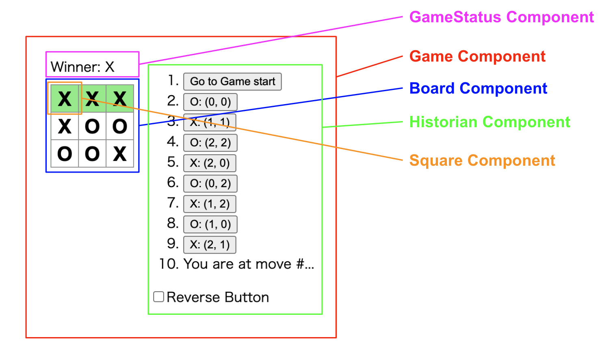

# React Tutorial TicTacToe

React チュートリアルの三目並べから以下を変更。

- JavaScript > TypeScript
- コンポーネントの分け方をチュートリアルを見ずに設計しなおして書いた



## メモ

build したファイルを VSCode の LiveServer でホスティングする場合は、`.vscode/settings.json` に以下の記述が必要

```json
{
  "liveServer.settings.root": "/dist"
}
```
